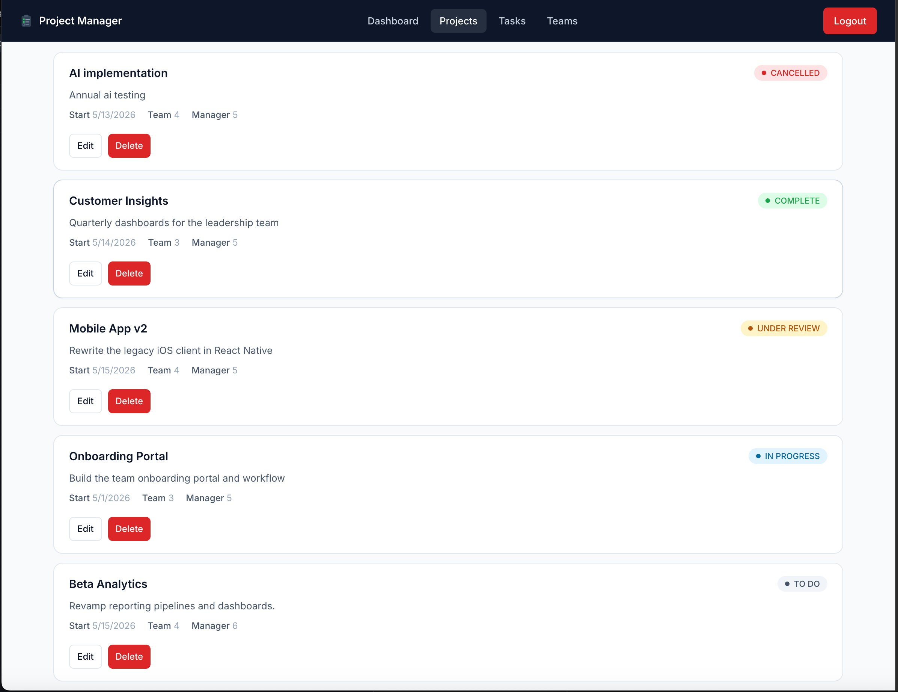

# Project Manager

A full-stack project management app for teams to plan projects, track tasks, and manage members. Built as a learning project to practice production-style architecture: layered backend, JWT auth with role-based authorization, OpenAPI-documented endpoints, and a refined React frontend.

> **Live demo:** _add URL after deploying — see [Deployment](#deployment)_


<!-- Take a screenshot of the running app and save it to docs/screenshot.png -->

---

## Features

- Sign up and log in with JWT-based authentication
- Role-based access control (`MANAGER` and `DEVELOPER`)
- CRUD for teams, projects, and tasks with the relationships you'd expect
- Server-side validation with friendly error messages
- OpenAPI 3 spec + Swagger UI for the API
- Responsive UI with status badges, empty states, and consistent design tokens

## Tech stack

**Frontend** — React 19, Vite, React Router, Axios, custom CSS design system

**Backend** — Node.js, Express 5, Prisma ORM, express-validator, bcrypt, jsonwebtoken

**Database** — PostgreSQL

**Tooling** — ESLint, Prettier, OpenAPI 3 (Redocly CLI), supertest

## Architecture

```
project-manager-app/
├── project-manager-api/          Express + Prisma backend
│   ├── prisma/                   schema + migrations
│   ├── documents/                OpenAPI 3 spec (modular)
│   └── src/
│       ├── routes/               HTTP routing
│       ├── controllers/          request/response shaping
│       ├── middleware/           auth, validators, role checks
│       ├── services/             business logic
│       ├── repositories/         Prisma data access
│       └── server.js             app entry point
└── project-manager-frontend/     React + Vite frontend
    └── src/
        ├── api/                  axios clients per resource
        ├── components/           shared UI (login, signup, ...)
        ├── layouts/              ProtectedRoute, Layout
        ├── pages/                Dashboard, Projects, Tasks, Teams
        └── styles/               page-specific CSS
```

The backend follows a **route → controller → service → repository** layering so each concern has one home: HTTP shaping in controllers, validation in middleware, business rules in services, Prisma queries in repositories.

## Getting started locally

### Prerequisites

- Node.js **20.6+** (for native `--env-file` support)
- A running PostgreSQL instance (local Docker, Postgres.app, or a Neon dev branch)
- npm

### 1. Clone and install

```bash
git clone <your-fork-url>
cd project-manager-app

cd project-manager-api && npm install
cd ../project-manager-frontend && npm install
```

### 2. Configure environment

Copy the example env files and fill them in:

```bash
cp project-manager-api/.env.example project-manager-api/.env
cp project-manager-frontend/.env.example project-manager-frontend/.env
```

API needs `DATABASE_URL`, `JWT_SECRET`, `PORT`, and `FRONTEND_URL`. Generate a strong JWT secret with:

```bash
node -e "console.log(require('crypto').randomBytes(48).toString('hex'))"
```

### 3. Run database migrations

```bash
cd project-manager-api
npx prisma migrate dev
```

### 4. Start both servers

In one terminal:

```bash
cd project-manager-api
npm run dev
```

In another:

```bash
cd project-manager-frontend
npm run dev
```

Visit `http://localhost:5173`.

Interactive API docs are at `http://localhost:8080/api-docs`.

## Environment variables

### `project-manager-api/.env`

| Variable | Description |
| --- | --- |
| `DATABASE_URL` | PostgreSQL connection string |
| `JWT_SECRET` | Long random string used to sign JWTs |
| `PORT` | Port to listen on (defaults to 3000) |
| `FRONTEND_URL` | Comma-separated list of allowed CORS origins |

### `project-manager-frontend/.env`

| Variable | Description |
| --- | --- |
| `VITE_API_URL` | Base URL of the backend API |

## Deployment

The project is designed to deploy as two independent services plus a managed Postgres.

| Layer | Recommended host |
| --- | --- |
| Frontend | Vercel or Netlify |
| Backend | Render, Fly.io, or Railway |
| Database | Neon, Supabase, or Render Postgres |

**Backend deploy notes:**

- Build command: `npm install && npx prisma generate && npx prisma migrate deploy`
- Start command: `npm start`
- Env vars on the host: `DATABASE_URL`, `JWT_SECRET`, `FRONTEND_URL`

**Frontend deploy notes:**

- Root directory: `project-manager-frontend`
- Build command: `npm run build`
- Env var: `VITE_API_URL` set to your deployed backend URL

After both are up, update `FRONTEND_URL` on the backend host to your deployed frontend URL and redeploy.

## API overview

| Method | Path | Description |
| --- | --- | --- |
| POST | `/api/auth/signup` | Create an account |
| POST | `/api/auth/login` | Exchange credentials for a JWT |
| GET | `/api/users/me` | Current user info |
| GET | `/api/teams` | List teams |
| POST | `/api/teams` | Create a team (manager) |
| PUT | `/api/teams/:id` | Update a team (manager) |
| DELETE | `/api/teams/:id` | Delete a team (manager) |
| GET | `/api/projects` | List projects |
| POST | `/api/projects` | Create a project (manager) |
| PATCH | `/api/projects/:id` | Update a project (manager) |
| DELETE | `/api/projects/:id` | Delete a project (manager) |
| GET | `/api/tasks` | List all tasks |
| GET | `/api/tasks/me` | Tasks assigned to current user |
| POST | `/api/tasks` | Create a task (manager) |
| PATCH | `/api/tasks/:id` | Update a task (manager) |
| DELETE | `/api/tasks/:id` | Delete a task (manager) |

See the full OpenAPI spec at `/api-docs` once the server is running.

## Roadmap

Things I'd build next given more time:

- Task assignee picker on the frontend (currently the form only takes an ID)
- Kanban-style board view that lets you drag tasks between status columns
- Persist team descriptions (add a `description` column to the `teams` table)
- Comprehensive integration test suite with supertest + CI on every push
- Soft delete with audit history rather than hard deletes
- Email notifications when a task is assigned

## License

This project is open source under the MIT License.
